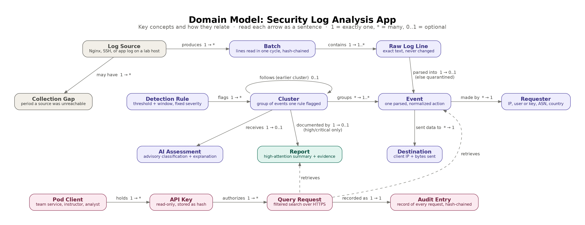
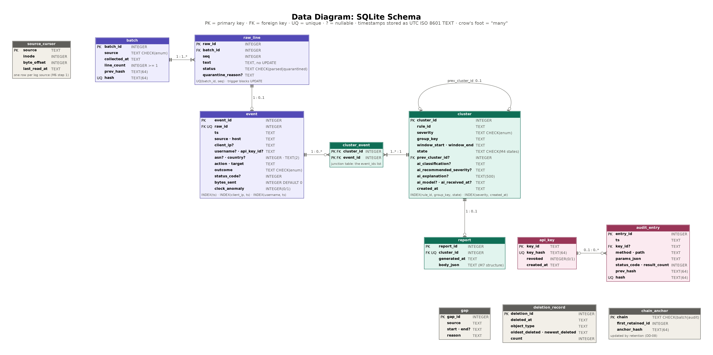

# SEC450

## Requirements

### Core behavior

| ID | Requirement | Source / need |
|----|-------------|---------------|
| REQ-01 | The system shall collect new entries from each configured lab source (Nginx access and error, SSH auth, application) at a configurable interval, default 60 seconds and never more than 5 minutes, and parse each entry into the common event schema (the `event` table in the data diagram) with timestamps converted to UTC using the source’s configured time zone. | NIST SP 800-92; NIST SP 800-53 AU-2, AU-3, AU-8 |
| REQ-02 | When an event is parsed, the system shall record the requester (client IP, authenticated or attempted username or API key ID if present, and ASN and country from an offline GeoIP database) and the data destination (client IP and bytes sent in the response). Forwarded-IP headers shall be trusted only from configured proxy addresses. | NIST SP 800-53 AU-3; stakeholder need: who made the request and where information went |
| REQ-03 | When events are stored, the system shall evaluate them against configurable detection rules and flag matches within 5 minutes of collection. At minimum: ≥5 failed logins from one source in 5 min (high); ≥20 distinct 404s from one source in 1 min (medium); path traversal or injection patterns (high); >10 MB sent to one client IP in 10 min (critical). | NIST SP 800-53 AU-6, SI-4 |
| REQ-04 | When a rule flags a cluster at medium severity or higher, the system shall remove credentials, cookies, authorization headers, and API keys from it, submit the redacted cluster to the LLM, and store the result labeled as AI-generated and advisory, without changing the rule-assigned severity. If the LLM fails or does not respond within 30 seconds after 2 retries, then the system shall mark triage as “unavailable” and continue. | NIST SP 800-53 SA-9; data minimization; detection must not depend on an external service |
| REQ-05 | The system shall provide an HTTPS query endpoint returning events, clusters, and reports filtered by time range, source IP, user, and severity. If a request has invalid parameters, then the endpoint shall return HTTP 400 with an error body and no partial data. | NIST SP 800-53 AU-7; RFC 9110; stakeholder need: on-demand investigation |
| REQ-06 | When a cluster reaches high or critical severity, the system shall generate a report within 10 minutes containing a summary, requester, data destination, timeline, matched rule, AI assessment, raw log lines, and integrity check result. | NIST SP 800-53 AU-6, AU-7; NIST SP 800-61 Rev. 3 |

### Failures, data, and security

| ID | Requirement | Source / need |
|----|-------------|---------------|
| REQ-07 | If an entry cannot be parsed, then the system shall quarantine it unchanged with the failure reason and continue. If a source is unreachable after 3 retries, then the system shall record a collection gap shown in affected queries and reports. If a timestamp is more than 5 minutes ahead of the collector clock, then the system shall flag a clock anomaly. | NIST SP 800-53 AU-5, AU-8 |
| REQ-08 | The system shall store every raw log line unmodified, linked to its parsed event, with each batch protected by a SHA-256 hash chain whose verification reports “intact” or the first mismatched batch. Events and raw lines shall be retained 30 days and reports 90 days (configurable), then deleted with each deletion recorded. | NIST SP 800-53 AU-9(3), AU-11; FIPS 180-4 |
| REQ-09 | The query endpoint shall accept only TLS 1.2 or later, require a read-only API key (stored only as a hash) on every request, limit each key to 60 requests per minute, return HTTP 401 or 429 on failure, and record every request (key ID, time, parameters, result count) in a hash-chained audit log. | NIST SP 800-53 IA-2, AC-3, SC-8, AU-2, AU-12; NIST SP 800-52 Rev. 2; RFC 9110; RFC 6585; OWASP API2:2023, API4:2023 |

### Quality

| ID | Requirement | Source / need |
|----|-------------|---------------|
| REQ-10 | The query endpoint shall return results for queries spanning up to 7 days within 2 seconds at the 95th percentile, with up to 100,000 stored events, on the reference host (4 CPU cores, 8 GB RAM). | Stakeholder need: usable investigation |
| REQ-11 | On the scripted attack scenario set, rule detection shall identify at least 90% of injected attacks, and no more than 10% of generated clusters shall be false alarms on baseline traffic. | Project evaluation need |
| REQ-12 | The complete system and lab shall start from a clean repository clone with a single docker compose up in under 10 minutes, with all settings in one configuration file. | Maintainability; reproducible grading |

## Acceptance criteria

Thirty criteria (AC-01 to AC-30) cover all 12 requirements. Methods are Test, Demonstration, Inspection and Analysis. **Auto** means the check runs unattended in CI; **Manual** means it needs a person. Timing is measured on the reference host (4 CPU cores, 8 GB RAM). Automated tests rely on three test hooks: a mock LLM, an injectable clock and the reference host.

### Collection and normalization

#### AC-01 · Collection timeliness
*REQ-01 · Test, Auto*
- **Setup:** Lab running, interval 60 s.
- **Action:** Append 100 tagged lines to each of the four sources at T0.
- **Pass:** All 400 lines stored with the correct source by T0 + 70 s.
- **Boundary:** An interval of 300 s starts; 301 s is rejected at startup.

#### AC-02 · Parsing to the event schema
*REQ-01, REQ-02 · Test, Auto*
- **Setup:** 40 fixture lines (10 per format) with hand-written expected events.
- **Pass:** Every field of every event matches exactly.
- **Boundary:** 10:00 local (America/Indiana/Indianapolis, October) is stored as 14:00Z; a line in the fall-back DST hour converts without error.

#### AC-03 · No loss or duplication
*REQ-01, REQ-08 · Test, Auto*
- **Action:** Write 1,000 known lines over 5 cycles; rotate the Nginx log mid-cycle; in a separate run, force one commit failure.
- **Pass:** Every line appears exactly once in both runs.

### Requester and destination

#### AC-04 · Requester and destination fields
*REQ-02 · Test, Auto*
- **Setup:** 20 fixture requests with known values; test GeoIP database.
- **Pass:** All 20 events correct; a known public test IP resolves to the expected ASN and country.
- **Boundary:** A private lab IP gives null ASN and country with no error.

#### AC-05 · Forwarded-IP trust
*REQ-02 · Test, Auto*
- **Action:** 10 requests with X-Forwarded-For from the trusted proxy, 10 from an untrusted peer.
- **Pass:** 20/20 correct; the header IP is used only when the peer is trusted.

### Detection

#### AC-06 · Rule thresholds and windows
*REQ-03 · Test, Auto*
- **Action:** For each rule: below threshold, at threshold, and threshold spread over window + 1 s.
- **Pass:** All 12 cases correct (no cluster, cluster with correct severity, no cluster).
- **Boundary:** R4 at 10,485,760 bytes creates no cluster; 10,485,761 does.

#### AC-07 · Detection latency
*REQ-03 · Test, Auto*
- **Action:** Run each attack script 5 times (20 runs).
- **Pass:** Maximum time from last triggering line to cluster creation ≤ 300 s.

#### AC-08 · Thresholds configurable without code changes
*REQ-03 · Demonstration + Inspection, Manual*
- **Action:** Change R1's count from 5 to 3 in config.yaml, restart, send 3 failed logins.
- **Pass:** A cluster is created, and git diff shows only config.yaml changed.

### AI triage

#### AC-09 · Redaction
*REQ-04 · Test, Auto*
- **Setup:** 50 events seeded with 5 secret types, 10 each; the mock LLM captures payloads.
- **Pass:** 0 seeded secrets in any payload; each payload has ≤ 50 events, only the allowed fields, and no raw lines.
- **Boundary:** A 31-character token is not redacted; 32 characters is.

#### AC-10 · Triage gating and advisory output
*REQ-03, REQ-04 · Test, Auto*
- **Action:** Create low, medium and high clusters; the mock recommends "critical" for all.
- **Pass:** 0 calls for low, 1 each for medium and high; stored severity unchanged; AI recommendation stored separately.

#### AC-11 · LLM failure path
*REQ-04, REQ-06 · Test, Auto*
- **Action:** The mock (a) responds after 35 s, (b) returns HTTP 500, (c) returns non-JSON, (d) returns JSON missing a field.
- **Pass:** Each case makes exactly 3 attempts and ends in TRIAGE_UNAVAILABLE; high clusters still get a report marked "unavailable"; the next batch processes normally.
- **Boundary:** A response at 29 s is accepted.

#### AC-12 · AI assessment usefulness (non-blocking)
*REQ-04 · Inspection, Manual (judgment)*
- **Action:** Two team members independently rate 10 real Claude explanations.
- **Pass:** ≥ 8 of 10 rated reasonable by both. A failure is recorded as a finding, not a blocker.

### Query endpoint

#### AC-13 · Filter correctness
*REQ-05 · Test, Auto*
- **Setup:** 1,000 seeded events.
- **Pass:** 10 predefined queries each return exactly the expected set.

#### AC-14 · Parameter validation
*REQ-05 · Test, Auto*
- **Action:** 14 requests covering bad ranges, a 31-day span and 31 days + 1 s, a malformed timestamp, an invalid IP, a bad severity, limit of 0/1/1000/1001, an unknown parameter, IPv6, and no filters.
- **Pass:** Invalid cases return 400 with an error body and no data; valid boundary cases return 200.

### Reports

#### AC-15 · Report generation, content and timing
*REQ-06, REQ-08 · Test, Auto*
- **Action:** Run brute-force, injection, large-transfer and scan scenarios.
- **Pass:** Each high or critical cluster gets exactly one report within 600 s, with all fields present, raw lines matching byte for byte, and a correct integrity result. The medium scan gets no report.

#### AC-16 · Report readability
*REQ-06 · Inspection, Manual (judgment)*
- **Action:** A teammate who didn't write the report code answers who, what, where and when for the 3 reports.
- **Pass:** All 12 answers correct using only the reports.

### Failure handling

#### AC-17 · Quarantine and health warning
*REQ-07 · Test, Auto*
- **Action:** Three 100-line batches with 4, 5 and 6 malformed lines.
- **Pass:** Malformed lines quarantined with reasons; a health warning appears only for the 6-line batch.

#### AC-18 · Source outage and gap reporting
*REQ-07, REQ-05, REQ-06 · Test, Auto*
- **Action:** Make the SSH log unreadable for 5 minutes during an attack scenario.
- **Pass:** A gap opens after 3 failed retries and closes within one interval of recovery; other sources continue; overlapping queries and reports list the gap.

#### AC-19 · Clock anomaly boundary
*REQ-07 · Test, Auto*
- **Action:** Lines stamped now + 4:59 and now + 5:01.
- **Pass:** The first is not flagged, the second is; both are stored and evaluated.

### Integrity and retention

#### AC-20 · Raw lines immutable
*REQ-08 · Inspection + Test, Manual + Auto*
- **Pass:** No code path updates a raw line, and the database rejects an UPDATE attempt.

#### AC-21 · Tamper detection
*REQ-08 · Test, Auto*
- **Action:** 50 batches; verify; change one character in batch 23 and verify; restore, delete batch 30, and verify.
- **Pass:** intact, then broken at batch 23, then broken at the first mismatch (30 or 31), with the exact batch ID.

#### AC-22 · Retention boundaries
*REQ-08 · Test, Auto*
- **Setup:** Events aged 29 d 23 h and 30 d 1 h; reports aged 89 d 23 h and 90 d 1 h.
- **Pass:** Only the older item in each pair is deleted; one deletion record per type; verification afterward returns intact.

### API security

#### AC-23 · TLS enforcement
*REQ-09 · Test, Auto*
- **Pass:** Plain HTTP, TLS 1.0 and TLS 1.1 fail at connection with no audit entry; TLS 1.2 and 1.3 succeed.

#### AC-24 · Authentication and key storage
*REQ-09 · Test + Inspection, Auto + Manual*
- **Pass:** Missing, wrong and revoked keys get 401; a valid key gets 200; no plaintext key exists in the database or config.

#### AC-25 · Rate limit
*REQ-09 · Test, Auto*
- **Action:** 60 requests in 50 s, a 61st immediately, then one more 61 s after the first.
- **Pass:** The first 60 are not limited, the 61st gets 429 with Retry-After, and the final request is accepted. Tolerance ±1 s.

#### AC-26 · Audit completeness and fail-closed
*REQ-09 · Test, Auto*
- **Action:** 20 requests producing 200, 400, 401, 429 and an induced 500; then make the audit table unwritable and send one valid request.
- **Pass:** Exactly 20 correct audit entries with the chain intact; the final request returns 500 with no data.

### Quality targets

#### AC-27 · Query performance
*REQ-10 · Test + Analysis, Auto + Manual*
- **Setup:** 100,000 events over 30 days on the reference host.
- **Pass:** 200 mixed queries (1 to 7 day spans) with p95 ≤ 2.0 s and zero errors; outliers reviewed for harness problems.

#### AC-28 · Detection accuracy
*REQ-11, REQ-03 · Test + Analysis, Auto + Manual*
- **Setup:** ≥ 28 injected attacks (≥ 7 per rule) in 60 minutes of baseline traffic, with ground truth logged.
- **Pass:** In each of 3 seeded runs, detection rate ≥ 90% and false alarms (clusters matching no attack ÷ all clusters) ≤ 10%.

#### AC-29 · Clean-clone startup
*REQ-12 · Demonstration, Manual*
- **Setup:** A machine with only Docker. The only allowed prep is copying config.example.yaml to config.yaml and adding the Claude API key.
- **Pass:** A teammate who didn't write the deployment files gets all services healthy within 600 s, and the brute-force scenario produces a report.

#### AC-30 · Single configuration file
*REQ-12, REQ-03 · Inspection, Manual*
- **Pass:** Every deployment setting is read from config.yaml; none are hard-coded.

## Traceability

Every requirement has at least one acceptance criterion.

| Requirement | Acceptance criteria |
|-------------|---------------------|
| REQ-01 | AC-01, AC-02, AC-03 |
| REQ-02 | AC-02, AC-04, AC-05 |
| REQ-03 | AC-06, AC-07, AC-08, AC-10, AC-28, AC-30 |
| REQ-04 | AC-09, AC-10, AC-11, AC-12 |
| REQ-05 | AC-13, AC-14, AC-18 |
| REQ-06 | AC-11, AC-15, AC-16, AC-18 |
| REQ-07 | AC-17, AC-18, AC-19 |
| REQ-08 | AC-03, AC-15, AC-20, AC-21, AC-22 |
| REQ-09 | AC-23, AC-24, AC-25, AC-26 |
| REQ-10 | AC-27 |
| REQ-11 | AC-28 |
| REQ-12 | AC-29, AC-30 |

21 criteria are fully automated. Four combine automated runs with a manual step (AC-20, AC-24, AC-27, AC-28). Five are fully manual (AC-08, AC-12, AC-16, AC-29, AC-30), including the two judgment checks AC-12 and AC-16. AC-12 is the only non-blocking criterion.

## Design decisions

| ID | Decision | Choice | Alternative considered | Tradeoff | Affects |
|----|----------|--------|------------------------|----------|---------|
| DD-01 | Rules detect, AI advises | Four fixed rules decide what's flagged and how severe; Claude's assessment is stored separately and never changes severity | Let the LLM classify events and set severity | The AI might catch new attack types, but its answers vary between runs and can't be tested reliably. Rules are predictable and verifiable. | REQ-03, REQ-04, REQ-11; testability, reliability |
| DD-02 | Redacted clusters to a hosted LLM | Only medium-or-higher clusters, at most 50 events, credentials removed | Send full log batches, or run a local model | A local model keeps data in-house but is slow and weaker on lab hardware. Full batches cost more and expose more data. | REQ-04; confidentiality, cost |
| DD-03 | Synthetic Docker lab | All logs come from our own containers and traffic generator | Real servers or public datasets | Real servers raise permission and privacy questions and lack ground truth. The lab gives exact ground truth and a repeatable demo, though accuracy may look better than on real traffic. | REQ-11, REQ-12; testability, ethics |
| DD-04 | Logs from shared folders | The collector reads each lab server's logs from a read-only shared folder | Log-shipping agents or SSH | Those are how real companies do it, but they add setup and failure points. On one machine, shared folders are the simplest option that works. | REQ-01, REQ-12; simplicity |
| DD-05 | 60-second batches | Collect on a fixed interval, one batch per read | Stream lines continuously | Streaming is faster but complicates hash-chaining and exactly-once storage. A minute of delay fits the 5-minute detection limit. | REQ-01, REQ-03, REQ-08; simplicity, integrity |
| DD-06 | SQLite database | One SQLite file in WAL mode, shared by the collector and API | PostgreSQL, Neo4j, Elasticsearch | The others handle concurrency or search better but each adds a service. The risk is write contention; Postgres is the fallback if lock errors appear or AC-27 fails. | REQ-08, REQ-10, REQ-12; simplicity, performance |
| DD-07 | Hash-chained batches | Each batch's SHA-256 hash includes the previous batch's hash | Digital signatures or write-once storage | Hash-chaining is simple and catches edits, deletions and reordering. Someone with full database write access could rebuild the chain; that attacker is out of scope. | REQ-08, REQ-09; integrity |
| DD-08 | Retention moves the chain anchor | After deleting old batches, record the new starting point and verify from there | Never delete, or restart the chain | Never deleting breaks the retention rule; restarting leaves a window where tampering goes unnoticed. Moving the anchor costs one small table. | REQ-08; integrity |
| DD-09 | Clusters freeze at triage | Once sent to the LLM, a cluster takes no new events; later matches start a linked cluster | Keep extending clusters and re-triage | Extending gives one complete picture but means repeat LLM calls and changing reports. Freezing keeps reports stable, though long attacks may split. | REQ-04, REQ-06; simplicity, cost |
| DD-10 | One HTTPS entry point | Only the API container has a published port; all pod requests enter there | Direct database access, or one combined service | Direct access skips auth and auditing; combining lets an API bug affect collection. Separation keeps the attack surface in one place. | REQ-05, REQ-09; security |
| DD-11 | Hashed API keys | Random read-only keys, stored only as SHA-256 hashes | OAuth 2.0 or mutual TLS | Those are stronger but need infrastructure out of scale for a semester project. Keys are simple to issue and revoke. | REQ-09; security, interoperability |
| DD-12 | Audit logging fails closed | If the audit entry can't be written, the request fails with no data | Answer anyway and log the failure | An audit problem causes downtime, but an unrecorded read is worse for a security tool. | REQ-09; accountability |
| DD-13 | Offline GeoIP | Local GeoLite2 lookups | An online IP-lookup API | Online is more current but adds an outside dependency and shares every IP with a third party. Offline is fast and private but slightly stale. | REQ-02; reliability, privacy |
| DD-14 | Detect and report, never block | No automated blocking | Automatically block flagged IPs | Blocking is useful but a false alarm could cut off real traffic and adds scope. A person stays in control. | REQ-03, REQ-06; safety, scope |
| DD-15 | Python with FastAPI | Python throughout, FastAPI for the API | Go or Node.js | Go is faster, but the whole team knows Python and FastAPI handles validation almost for free. Database indexing, not language, will decide REQ-10. | REQ-05, REQ-10, REQ-12; maintainability |
